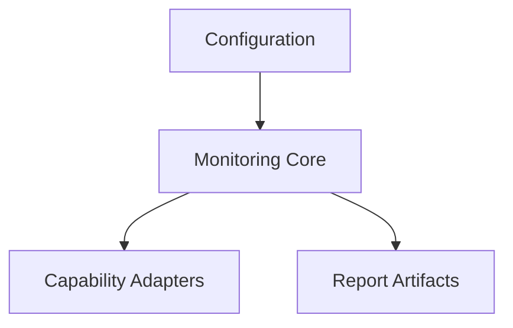

# Module Map

- configuration → planned config files.
- monitoring core → planned orchestration entry.
- capability adapters → planned external integrations.
- report artifacts → planned output files.

