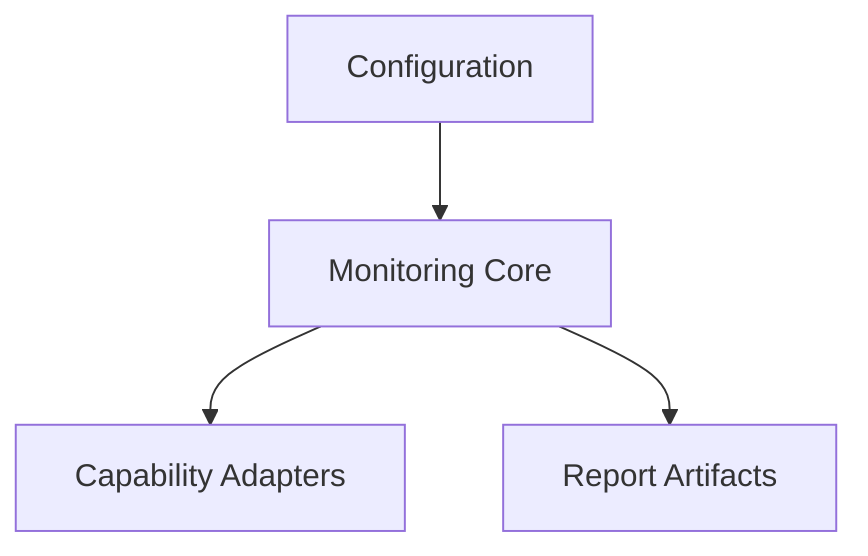

# Module Map

- configuration → `monitoring-orchestrator/config/`.
- monitoring core → `.agents/monitoring-agent.md` and `monitoring-orchestrator/SKILL.md`.
- capability adapters → Datadog MCP, Stability SDK, Sentry REST, GitHub Actions.
- report artifacts → `artifacts/monitoring/`.
