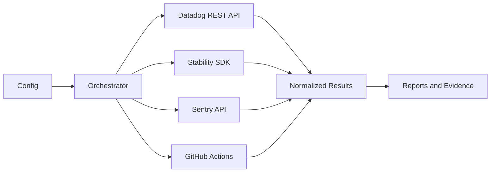

# System Map

```mermaid
flowchart LR
  Config[Config] --> Orchestrator[Orchestrator]
  Orchestrator --> Datadog[Datadog REST API]
  Orchestrator --> Stability[Stability SDK]
  Orchestrator --> Sentry[Sentry API]
  Orchestrator --> Patrol[GitHub Actions]
  Datadog --> Results[Normalized Results]
  Stability --> Results
  Sentry --> Results
  Patrol --> Results
  Results --> Reports[Reports and Evidence]
```
