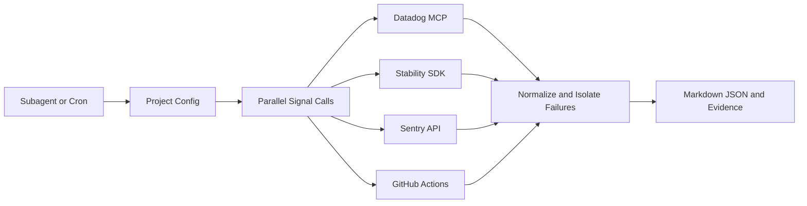

# Monitoring Agent Phase 1

## Overview

Configuration-driven monitoring for multiple projects. The Subagent delegates to a Skill that invokes four real monitoring capabilities and emits normalized reports with evidence.

## Architecture

## Key Files

| File | Role |
|------|------|
| `.agents/monitoring-agent.md` | Thin Subagent entry and no-fabrication contract |
| `monitoring-orchestrator/SKILL.md` | Orchestration sequence and capability whitelist |
| `monitoring-orchestrator/adapters/` | Platform HTTP adapters and shared runtime helpers |
| `monitoring-orchestrator/runtime.py` | Backward-compatible adapter import facade |
| `monitoring-orchestrator/config/monitoring_config.yaml` | Multi-project non-secret Skill configuration |
| `monitoring-orchestrator/references/contracts.md` | Normalized signal envelope |
| `monitoring-orchestrator/templates/monitoring_report.md.tpl` | Four-signal report layout |

## Implementation Notes

- Four paths run independently; one timeout or exception cannot block other signals.
- Missing credentials produce `unavailable`; metrics remain empty.
- Datadog, Stability SDK, and Sentry share `time_range` (`today`, `yesterday`, `last_<N>d`, or explicit UTC bounds). Sentry compares it with the immediately preceding equal-duration window and omits percentage delta when baseline is zero.
- Stability SDK invokes `fe-stability-analysis` with `output_mode=analysis_only`, consumes one cross-project overview plus one independent JSON per project, and does not generate a separate Stability Markdown report.
- tracking_patrol reads latest by default; `trigger` is explicit in config or manual override.
- Tokens are read from environment variables and recursively redacted in evidence.
- Datadog and Stability SDK remain agent capability calls; the Python runtime does not fabricate or emulate MCP results. Datadog resolves `datadog.service` first and falls back to the project `app_name`.
- Each run writes `report.md` and `report.json` under its timestamped artifact directory; the resolved time range is report content, not filename metadata.

## Dependencies

- `user-datadog` MCP → Datadog metrics, monitors, and events.
- `fe-stability-analysis` → Stability SDK signal chain.
- Sentry REST API → error counts for two 24-hour windows.
- GitHub Actions API → tracking_patrol workflow runs and dispatch.
- Python standard library → HTTP, JSON, timestamps, and filesystem evidence.
